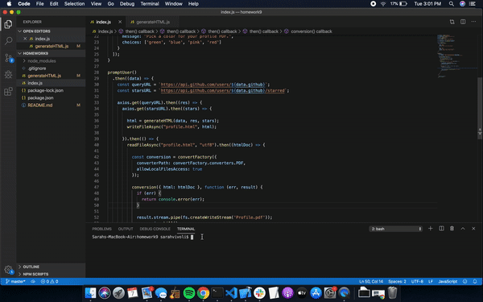

# Github-PDF-Generator

## Instructions

1. With terminal pointing toward the project's directory, enter the following command:
```sh
node index.js
```
2. Answer the 2 prompts ("What is your GitHub username?" & "Pick a color for your profile PDF.").
3. Wait patiently while the profile.html and Profile.pdf files are generated.
4. Access the files in the project's directory.
5. Share and enjoy!
* Running the command a second time will replace the originally created files, so save to a new location or rename before running again.

## Links to Project

[Live Link](https://svivoli.github.io/github-pdf-generator/)  
[Repository](https://github.com/svivoli/github-pdf-generator)

## Description

A command line application that takes user inputs to generate a PDF document displaying a summary of the user's GitHub profile details. This is a useful for preparing reports for stakeholders, or a concise supplement for resumes and portfolios.

### Node Modules

1. Axios
2. Electron
3. Electron-html-to
4. Inquirer
5. Util
6. Fs
7. Prebuilt modules

### PDF Components

1. Photo Header
- Avatar
- Name
- Company
- Links: Location (Google Maps), GitHub profile, blog
2. Bio
3. Cards
- Number of GitHub repositories
- Number of Github followers
- Number of GitHub stars
- Number of GitHub following
4. Color theme depening on color selected by user
5. Bootstrap grid
* Any GitHub information that is blank on a user's profile will appear as "null" on the PDF

## User Experience



## Developer Experience

I found this project to be a fun challenge. There were several components to comprise and combine. It was my first time working with html that was generated in a js document, which I approached by first writing in an html file and copying over to the generateHTML.js file once completed. I made use of the npm documentation found online for the conversion piece. I also worked to incorporate es6 arrow functions into my code as I like how concise they are. The challenge of this project presented the opportunity to meet with classmates outside of class which is always a great learning opportunity for me. The project overall exemplifies how much is possible when writing code. We were able to produce two new documents with one command and two prompts - pretty sweet!

--Sarah Vivoli


